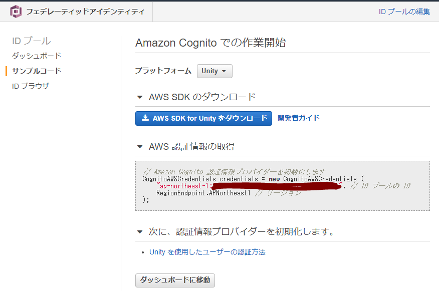

# UniPictShare

Take screen shot, and easy share for mobile.

スクリーンショットをAmazon S3にアップしてマッハでシェアできるものです。環境依存しない。たぶん。


## How to use

### 1. import libralies

+ Import AWS S3 SDK
+ Import UniRx

### 2. Create AWS S3 bucket

パブリックアクセス可能なS3バケットを用意する

Amazon S3 バケットポリシーの設定

```json
{
    "Version": "2012-10-17",
    "Statement": [
        {
            "Sid": "PublicReadForGetBucketObjects",
            "Effect": "Allow",
            "Principal": "*",
            "Action": "s3:GetObject",
            "Resource": "arn:aws:s3:::【バケット名】/*"
        }
    ]
}
```


### 3. Create AWS Cognete role

### IDプールの追加

IDプールの追加を行う。名前は任意で、認証されていないIDのアクセスを有効にチェックを入れる

https://ap-northeast-1.console.aws.amazon.com/cognito/create/




Unityに持って行くのはここで得られた認証情報の項目

#### ポリシーの追加

IAMポリシーの追加を行う。名前は任意でよい。  
ここでは `S3_Resource_【バケット名】` とする。

内容は任意のバケット以下に降るアクセスとする。

```
{
    "Version": "2012-10-17",
    "Statement": [
        {
            "Sid": "VisualEditor0",
            "Effect": "Allow",
            "Action": "s3:*",
            "Resource": "arn:aws:s3:::【バケット名】/*"
        }
    ]
}
```

#### Cognete ロールへのポリシー追加

IAMロールの変更から `Cognito_【Cognete ID プール名】Unauth_Role` の編集を行い、先ほどのポリシーをアタッチする。


### 4. Configure Unity project

* 以下のパラメータを設定する

    * UniPictShare.ScreenShot.**IdentityPoolId** : AWS Cogneteで得た IDプールのID(日本語おかしいけど公式でこう書いてるんだ…)  
    * UniPictShare.ScreenShot.**regionVal** : RegionEndpoint.APNortheast1 など、AWSのリージョンが入る  
    * UniPictShare.ScreenShot.**backetName** : S3のバケット名  

* スクリーンショットのトリガを設定する  
    * UniPictShare.ScreenShot.**TakeScreenShot()** を実行させる

* QRコードを隠すトリガを設定する  
    * UniPictShare.ScreenShot.**HideQECode()** を実行させる

## Dipendencies & Libralies

参考にした・使用したライブラリは以下です

### negipoyoc/ScreenShot.cs 

https://negipoyoc.com/blog/acrylic/
https://gist.github.com/negipoyoc/5bf5db8e0187c167a823cb05ff1b2182

### negipoyoc/QRCodeUtil

https://negipoyoc.com/blog/making-qrcode-with-unity/

### ZXing.Net

https://github.com/micjahn/ZXing.Net

License: Apache-2.0

### AWS Mobile SDK for Unity

#### Official Documents

https://docs.aws.amazon.com/ja_jp/mobile/sdkforunity/developerguide/what-is-unity-plugin.html
https://docs.aws.amazon.com/ja_jp/mobile/sdkforunity/developerguide/s3.html

#### Download

http://sdk-for-net.amazonwebservices.com/latest/aws-sdk-unity.zip

Use AWSSDK.S3.3.3.27.1.unitypackage only

License: Apache-2.0

### UniRx

https://github.com/neuecc/UniRx

License: MIT
